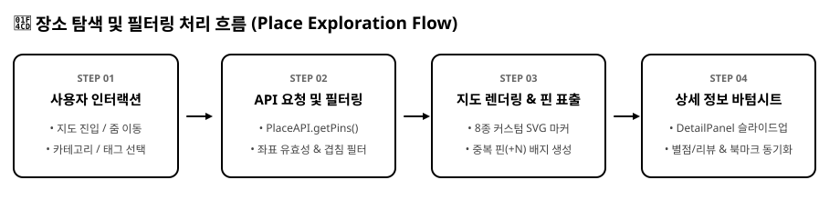
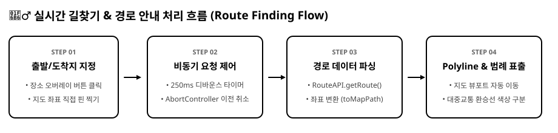
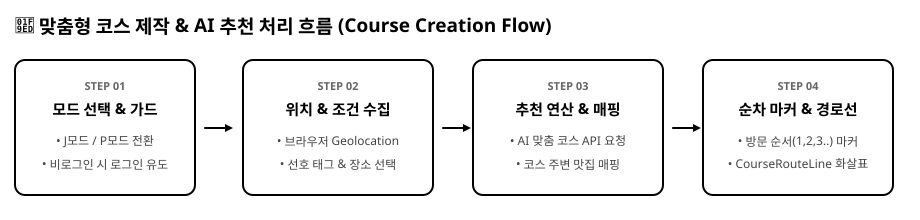
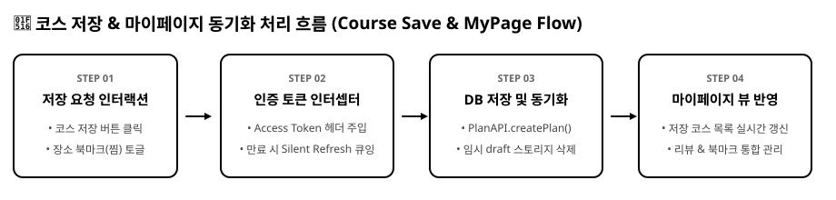
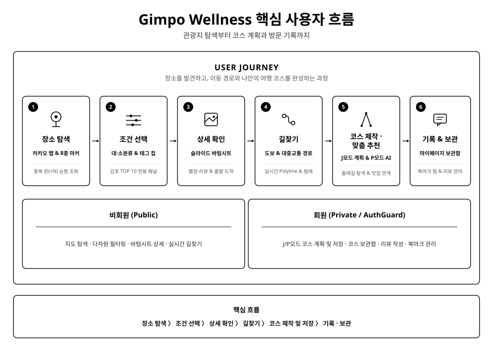
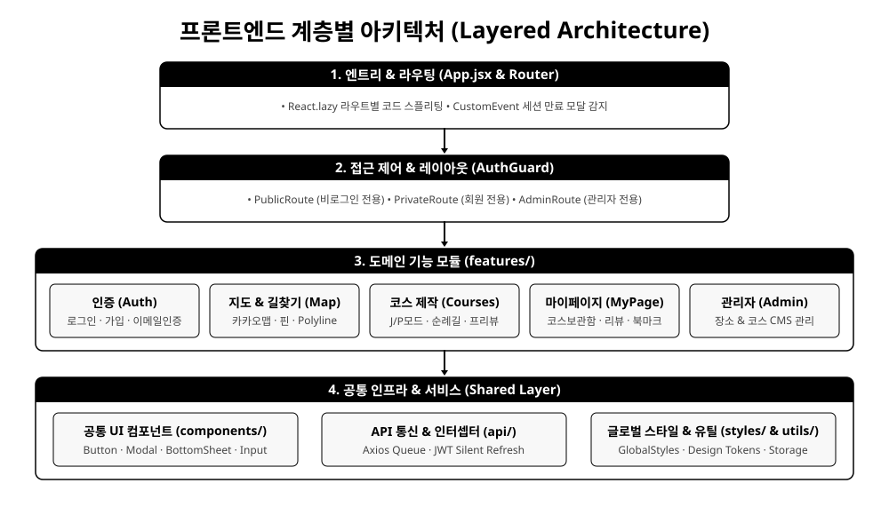

# Gimpo Wellness Frontend

> 김포 관광 데이터를 직관적으로 탐색하고, 사용자 조건에 맞는 여행 코스를 생성·저장하는 프론트엔드 서비스

<p align="center">
  <a href="https://gimpo-wellness.com">
    
  </a>
  <a href="https://github.com/kkimmun/wellness-backend">
    
  </a>
</p>

---

## 프로젝트 개요

**“김포 여행을 찾고, 구성하고, 다시 꺼내 보는 서비스”**

저희 팀은 기획 과정에서 실질적인 서비스 개선과 문제 해결을 위해 **김포시청 관광진흥과 인터뷰**를 진행했습니다.

인터뷰를 통해 주요 관광지의 홍보 부족, 관광 정보의 분산, 세분화된 장소 검색의 어려움, 애기봉과 대명항 함상공원 주변 음식점 정보 부족을 확인했습니다.

이를 바탕으로 관광 장소의 위치와 상세 정보를 제공하여 사용자가 직접 계획하거나 조건에 맞는 코스를 추천받아 저장할 수 있는 플랫폼을 만들게 되었습니다.

프론트엔드에서는 이러한 서비스 흐름을 사용자가 직관적으로 경험할 수 있도록 **장소 탐색부터 코스 생성, 저장까지의 사용자 여정을 중심으로 UI와 반응형 인터랙션을 구현**했습니다.

---

## 기술 스택

<p align="center">
  
  
  
  
  
  
  
  
  
  
</p>

| 분야                   | 기술 / 라이브러리              | 설명                                             |
| :--------------------- | :----------------------------- | :----------------------------------------------- |
| **Language & Runtime** | JavaScript (ES6+), Node.js     | 모던 자바스크립트 및 런타임 환경                 |
| **Framework & Build**  | React 19, Vite                 | 최신 React 기반 빠른 HMR 및 번들 빌드 최적화     |
| **Routing & HTTP**     | React Router v7, Axios         | 선언적 라우팅 및 인터셉터 기반 REST API 통신     |
| **Styling & Icons**    | styled-components, React Icons | CSS-in-JS 기반 디자인 토큰 및 반응형 UI 스타일링 |
| **Data Viz & Map**     | Recharts, React Kakao Maps SDK | 카카오 맵 오버레이 렌더링 및 통계 데이터 시각화  |
| **Linter & Quality**   | ESLint                         | 코드 컨벤션 및 정적 분석 관리                    |

---

## 프로젝트 목표

> 김포시청의 요구사항을 반영하고 김포에 방문하는 여행자들에게 맞춤형 서비스를 안정적으로 제공합니다.

- **해결하려던 문제**  
  김포의 관광 정보가 여러 채널에 흩어져 있고 장소 분류가 단순해, 사용자가 잘 알려지지 않은 관광지를 발견하거나 여러 장소의 이동 경로를 한 번에 계획하기 어려웠습니다.

- **바꾸려던 사용자 경험**  
  관광지를 개별적으로 검색하고 길찾기를 반복하는 과정에서 벗어나, 원하는 장소를 발견한 뒤 이동수단과 취향에 맞는 하나의 여행 코스까지 이어서 확인할 수 있도록 했습니다.

- **이번 프로젝트에서 해결할 범위**  
  정제된 데이터를 장소 조회, 경로 찾기, 여행·순례길 코스 생성, 인증·리뷰 등 각 기능의 흐름에 맞게 사용자 경험을 제공할 수 있도록 디자인 토큰을 지정하고, 모바일/웹 사용자의 범용성을 고려하여 반응형 기능을 구현했습니다.

---

## 핵심 기능

### 1. 장소 조회 & 필터링 (Explore Places)

<p align="center">
  
</p>

- **인터랙티브 맵 & 8종 커스텀 마커**: 관광지, 음식점, 체육, 의료 등 카테고리별 마커와 김포 TOP 10 황금 핀을 지도에 시각화합니다.
- **다차원 태그 필터 & 검색**: 대분류/세부분류 및 테마 태그를 조합하여 원하는 장소만 지도 위에 정밀하게 필터링합니다.
- **슬라이드 바텀시트 (DetailPanel)**: 장소 선택 시 도로명 주소, 평균 별점, 실제 방문자 리뷰를 확인하고 원클릭 출발/도착지 지정 및 북마크를 지원합니다.
- **중복 핀 순환 알고리즘**: 초근접 위치에 겹친 장소들을 `+N` 배지로 묶고 클릭 시 순환 탐색할 수 있도록 처리했습니다.

---

### 2. 실시간 길찾기 & 경로 안내 (Route Finding)

<p align="center">
  
</p>

- **원클릭 경로 탐색**: 장소 오버레이의 [출발], [도착] 버튼 또는 지도 좌표를 직접 지정하여 도보 및 대중교통 최적 경로를 탐색합니다.
- **실시간 Polyline & 범례 렌더링**: 대중교통 버스·지하철 환승 구간별 색상 구분선과 도보 이동 화살표를 지도에 시각화하고 하단 범례를 표출합니다.
- **비동기 요청 제어 최적화**: 250ms 디바운스와 `AbortController`를 통해 빠른 마커 변경 시 이전 요청을 즉시 취소하여 Race Condition을 방지합니다.

---

### 3. 맞춤형 코스 제작 & 추천 (Course Creation)

<p align="center">
  
</p>

- **J모드 (여행 계획형 직접 코스 설계)**: 출발지(현재 위치/김포시청)를 기준으로 가고 싶은 장소를 순서대로 담아 나만의 여행 동선을 설계하고 계획을 저장합니다.
- **P모드 (AI 맞춤 힐링 추천)**: 여행자의 현재 위치와 선호 태그를 기반으로 부담 없이 즐길 수 있는 맞춤형 힐링 코스를 즉시 추천받습니다.
- **고정 둘레길 & 맛집 연계**: 김포의 공식 웰니스 둘레길 코스를 단계별로 탐색하고, 코스 주변 식당/카페 정보를 연동하여 제공합니다.

---

### 4. 코스 저장 & 마이페이지 (Save & MyPage)

<p align="center">
  
</p>

- **나만의 맞춤 코스 보관함**: 생성한 여행 계획을 계정에 영구 저장하고 마이페이지에서 언제든지 원클릭으로 다시 꺼내볼 수 있습니다.
- **관심 장소 북마크(찜) 관리**: 가고 싶은 장소를 찜하고 마이페이지에서 원클릭으로 해당 지도 위치로 이동합니다.
- **방문 리뷰 & 평점 관리**: 실제 다녀온 명소에 대한 별점과 솔직한 후기를 작성하고 내가 쓴 리뷰를 통합 관리합니다.

---

## 사용자 흐름 (User Flow)

장소 탐색부터 이동 경로 확인, 여행 코스 계획, 방문 후 기록까지를 하나의 사용자 흐름으로 연결했습니다.

<p align="center">
  
</p>

---

## 핵심 구현 내용

- **순차적 인증 프로세스 설계**: `React Router`의 Route State와 `sessionStorage`를 활용하여 이메일 요청 ➡️ 5자리 코드 검증 ➡️ 가입 폼 작성까지 이어지는 안전한 순차적 인증 흐름을 구축했습니다.
- **실시간 타이머 및 재전송 제어**: 이메일 인증 시 3분 제한시간 카운트다운 타이머를 구현하고, 만료 시 자동 차단 및 재전송 인터랙션을 처리했습니다.
- **비즈니스 로직 단위 테스트 검증**: Node.js 내장 테스트 모듈(`node:test`, `node:assert`)을 활용하여 경로 디바운스 및 `AbortController` 취소 로직에 대한 단위 테스트를 작성하고 정합성을 검증했습니다.

---

## 성능 및 사용자 경험(UX) 개선

### 1. 비동기 요청 Race Condition 방지 및 API 호출 최적화

- **문제 상황**: 사용자가 지도에서 출발지, 경유지, 도착지 마커를 빠르게 연속 클릭하거나 변경할 때 불필요한 경로 탐색 API가 중복 호출되고, 이전 요청이 늦게 도착하여 최신 선택 경로를 덮어쓰는 문제가 발생했습니다.
- **해결 방식**:
  - **250ms 디바운스(Debounce)**를 적용하여 연속적인 사용자 인터랙션 시 최종 선택에 대해서만 경로를 요청하도록 제어했습니다.
  - **`AbortController`**를 도입하여 새로운 장소 선택 시 대기 중이던 이전 비동기 요청을 즉시 취소(`abort()`)했습니다.
- **효과**: 불필요한 네트워크 트래픽 감소 및 실시간 경로 렌더링 시 최신 데이터 정합성을 100% 보장하도록 했습니다.

### 2. JWT 재발급 레이스 컨디션 해결 (Request Queueing 패턴)

- **문제 상황**: 여러 컴포넌트가 마운트되면서 동시에 API를 호출할 때 Access Token이 만료되면 다수의 401 에러가 동시에 발생하여 `/auth/refresh`가 중복 호출되고 세션이 강제 종료되는 문제가 발생했습니다.
- **해결 방식**:
  - `Axios Interceptor` 내 `isRefreshing` 플래그와 **대기 큐(`pendingQueue`) 메커니즘**을 구축했습니다.
  - 토큰 만료 시 단 한 번만 재발급 API를 호출하고, 응답 전까지 인입된 요청들은 큐에 대기시켰다가 새 토큰을 수령하는 즉시 일괄 재요청(`resolveQueue`)하도록 했습니다.
- **효과**: 토큰 갱신 중 네트워크 단절 및 중복 재발급 에러를 원천 차단하여 끊김 없이 인증 상태가 유지되도록 했습니다.

### 3. 라우트 기반 코드 스플리팅(Code Splitting)으로 초기 로딩 속도 최적화

- **문제 상황**: 지도 SDK, 차트 라이브러리(Recharts), 관리자 페이지 등 다양한 라이브러리로 인해 초기 번들 크기가 비대해져 첫 페이지 로딩 속도가 저하될 우려가 있었습니다.
- **해결 방식**:
  - `React.lazy()` 및 `Suspense`를 적용하여 페이지 단위로 번들을 분할했습니다.
  - 사용자가 실제 해당 화면에 진입할 때 필요한 청크(Chunk) 파일만 동적으로 로드하도록 했습니다.
- **효과**: 초기 로딩 번들 크기 경량화 및 TTI(Time To Interactive)를 단축시켰습니다.

### 4. Custom Event 기반의 매끄러운 세션 만료 UX

- **문제 상황**: 인증 만료 시 강제 리다이렉트(`window.location.href`)를 실행하면 사용자가 작업 중이던 흐름이 갑작스럽게 끊겨 사용자 경험 저하가 발생할 우려가 있습니다.
- **해결 방식**:
  - Axios 응답 인터셉터에서 세션 만료 시 `CustomEvent("sessionExpired")`를 발행했습니다.
  - 최상단 `App.jsx`에서 이벤트를 감지하여 명확한 안내 모달을 띄운 뒤, 확인 클릭 시 부드럽게 로그인 페이지로 이동하도록 유도했습니다.
- **효과**: 사용자에게 명확한 상태 피드백을 전달하여 안정적인 서비스 경험을 제공할 수 있도록 했습니다.

---

## 반응형 UI (Responsive UI)

- **모바일 & 데스크톱 뷰포트 최적화**: 미디어 쿼리를 기반으로 데스크톱의 사이드 패널 레이아웃과 모바일 환경의 터치 친화적 UI를 유연하게 전환합니다.
- **인터랙티브 바텀시트 (BottomSheet)**: 모바일 환경에서 지도 뷰를 가리지 않으면서 장소 상세 정보, 검색 목록, 리뷰를 직관적으로 탐색할 수 있도록 제스처 친화적 슬라이드 패널을 적용했습니다.
- **디자인 토큰 시스템**: `styled-components`를 활용하여 일관된 컬러 팔레트, 폰트 스케일, 여백(Spacing) 규칙을 전역적으로 관리합니다.

---

## 주요 API

전체 API 중 프론트엔드의 핵심 사용자 인터랙션을 구성하는 대표 연동 API입니다.

| 영역               | Method | Endpoint                          | 프론트엔드 연동 모듈              | 설명                                        |
| :----------------- | :----: | :-------------------------------- | :-------------------------------- | :------------------------------------------ |
| **인증**           | `POST` | `/api/auth/login`                 | `src/api/auth.js`                 | 로그인 및 JWT 로컬스토리지 저장             |
| **인증**           | `POST` | `/api/auth/refresh`               | `src/api/axios.js`                | Access Token 만료 시 자동 재발급 (인터셉터) |
| **이메일 인증**    | `POST` | `/api/mail/auth`                  | `src/api/auth.js`                 | 이메일 인증 코드 발송 요청                  |
| **이메일 인증**    | `POST` | `/api/mail/auth/verification`     | `src/api/auth.js`                 | 5자리 인증 코드 검증                        |
| **장소 탐색**      | `GET`  | `/api/places`                     | `src/api/place.js`                | 장소 목록 조회 및 카테고리/태그 필터링      |
| **장소 상세**      | `GET`  | `/api/places/{placeNo}/detail`    | `src/api/place.js`                | 장소 상세 정보 및 바텀시트 연동             |
| **지도**           | `GET`  | `/api/places/pins`                | `src/api/place.js`                | 지도 렌더링용 마커 핀 좌표 조회             |
| **길찾기**         | `GET`  | `/api/routes`                     | `src/api/route.js`                | 이동수단별 경로, 거리, 소요 시간 조회       |
| **여행 계획**      | `POST` | `/api/plans`                      | `src/api/plan.js`                 | 나만의 여행 계획(J모드) 생성 및 저장        |
| **여행 계획**      | `GET`  | `/api/plans/nearby`               | `src/api/plan.js`                 | 현재 위치/기준점 주변 장소 조회             |
| **코스 추천**      | `POST` | `/api/course-recommendations`     | `src/api/courseRecommendation.js` | 선호 장소·태그 기반 맞춤코스(P모드) 추천    |
| **고정 코스**      | `GET`  | `/api/courses`                    | `src/api/course.js`               | 김포 둘레길/순례길 코스 목록 조회           |
| **코스 부가 기능** | `POST` | `/api/courses/restaurants`        | `src/api/course.js`               | 코스 주변 연계 음식점 추천                  |
| **리뷰**           | `POST` | `/api/places/{placeNo}/reviews`   | `src/api/review.js`               | 별점 및 장소 리뷰 등록                      |
| **북마크**         | `POST` | `/api/places/{placeNo}/bookmarks` | `src/api/bookmark.js`             | 장소 북마크 토글 등록/해제                  |

---

## 프로젝트 구조

<p align="center">
  
</p>

```text
src/
├── api/                       # 백엔드 연동 API 모듈화 및 Axios 설정
│   ├── axios.js               # Axios 인스턴스, Request Queueing & 토큰 인터셉터
│   ├── auth.js                # 인증/인가 (로그인, 회원가입, 이메일 검증)
│   ├── bookmark.js            # 장소 북마크 API
│   ├── course.js              # 코스 조회 및 연계 음식점 API
│   ├── courseRecommendation.js# 맞춤형 코스 추천(P모드) API
│   ├── place.js               # 장소 CRUD, 핀 좌표, 상세 조회 API
│   ├── plan.js                # 여행 계획(J모드) 생성 및 조회 API
│   └── route.js               # 길찾기 및 도보/대중교통 경로 API
│
├── assets/                    # 로고, 커스텀 마커 SVG, 문서 다이어그램
│   └── docs/                  # 아키텍처, 유저플로우, 기능별 SVG 다이어그램
│
├── components/                # 재사용 가능한 전역 공통 UI 컴포넌트
│   ├── Badge/                 # 상태/카테고리 뱃지
│   ├── BottomSheet/           # 모바일/웹 반응형 바텀시트
│   ├── Button/                # Primary/Secondary 버튼, 뒤로가기 버튼
│   ├── Card/                  # 장소 카드, 리뷰 카드
│   ├── Common/                # StarRating(별점), Pagination(페이지네이션)
│   ├── Input/                 # BaseInput, PasswordInput, ImageUploader
│   ├── Layout/                # MainLayout, AuthLayout, AdminLayout, AuthGuard
│   └── Modal/                 # Alert 모달, LoginRequiredModal, 전역 모달 스택
│
├── context/                   # 전역 상태 관리 Context
│   └── authContextValue.jsx   # 로그인 세션 및 사용자 Role 전역 상태
│
├── features/                  # 도메인/기능별 독립 모듈 (Feature-driven)
│   ├── admin/                 # [관리자] 장소/코스 등록, 수정 및 상세 관리
│   ├── auth/                  # [인증] 로그인, 회원가입, 이메일 요청 및 인증코드 검증
│   ├── courses/               # [코스] 고정 둘레길 코스, 커스텀 코스 생성 및 프리뷰
│   ├── landing/               # [랜딩] 서비스 소개 및 메인 랜딩 페이지
│   ├── map/                   # [지도 메인] 다중 모드 통합 지도 화면 및 패널
│   └── mypage/                # [마이페이지] 저장한 코스, 북마크, 활동 내역
│
├── styles/                    # 전역 스타일 및 디자인 토큰
│   └── GlobalStyles.js        # Reset CSS, 폰트, 컬러 팔레트 정의
│
├── utils/                     # 순수 유틸리티 함수 (JWT 디코딩, 날짜 포맷 등)
│
├── App.jsx                    # React.lazy 기반 라우팅 및 세션 이벤트 리스너
└── main.jsx                   # React 엔트리 포인트
```

---

## 팀 소개

|    팀원    | 프론트 담당 영역                                                                              |                                                                                                GitHub                                                                                                 |
| :--------: | :-------------------------------------------------------------------------------------------- | :---------------------------------------------------------------------------------------------------------------------------------------------------------------------------------------------------: |
| **김선겸** | 이동수단별 경로 조회, 현재 위치 기반 계획, 선호 장소·태그 기반 여행 코스 추천                 |             <a href="https://github.com/kkimmun"></a>              |
| **윤성현** | 이메일 중복 확인, 인증 코드 발송·만료 검증, 관리자 페이지(대시보드, 회원관리, 장소/코스 관리) | <a href="https://github.com/koyong3941-cell"></a> |
| **이다산** | 고정 코스, 순례길 후보 추천·경로 비교, 이미지 라이선스 관리                                   |              <a href="https://github.com/ham-zi"></a>               |
| **정주미** | 공통 디자인 UI, 회원가입/로그인 인증, 지도, 반응형 마커                                       |     <a href="https://github.com/peony639-lab"></a>      |

---

<p align="center">
  <strong>관광 데이터를 연결해, 김포에서의 다음 목적지를 제안합니다.</strong>
</p>
